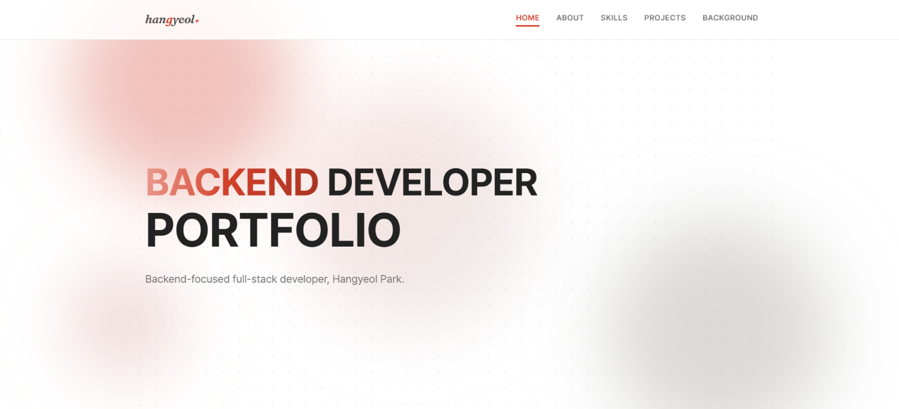

# Portfolio

### Hangyeol Park's Portfolio
<br>

백엔드 중심 신입 풀스택 개발자 박한결의 포트폴리오

<br>




<a href="https://1gyeolpark.github.io/Portfolio/" target="_blank" rel="noopener noreferrer"></a>

<br>

## 주요 기능

- 스크롤 위치에 따라 요소가 순차적으로 나타나는 리빌 애니메이션
- 모바일 화면에서 햄버거 메뉴로 전환되는 반응형 네비게이션
- 마우스를 따라다니는 커스텀 커서, 히어로 배경 패럴랙스
- 클릭하면 크게 보이는 이미지 팝업 모달
- 클립보드 이메일 주소 복사

<br>

## 기술 스택


<br>

## 프로젝트 구조

```
├── index.html
├── css
│   ├── tokens.css       # 색상 변수
│   ├── components.css   # 재사용 UI 부품
│   └── sections.css     # 전역 리셋과 섹션별 레이아웃
├── js                    # 기능별 스크립트
│   ├── nav.js
│   ├── scroll.js
│   ├── modal.js
│   ├── hero.js
│   ├── projects.js
│   ├── cursor.js
│   ├── marquee.js
│   └── email.js
└── images
```
